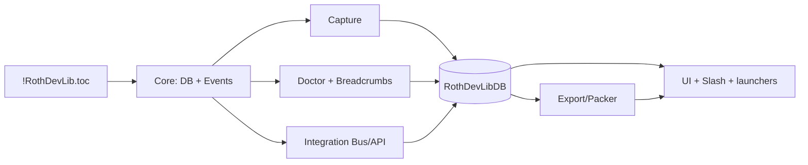

# Code graph

```mermaid
flowchart LR
  TOC["!RothDevLib.toc"] --> Core["Core: DB + Events"]
  Core --> Capture["Capture"]
  Core --> Doctor["Doctor + Breadcrumbs"]
  Core --> Bus["Integration Bus/API"]
  Capture --> DB[("RothDevLibDB")]
  Doctor --> DB
  Bus --> DB
  DB --> Export["Export/Packer"]
  DB --> UI["UI + Slash + launchers"]
  Export --> UI
```
