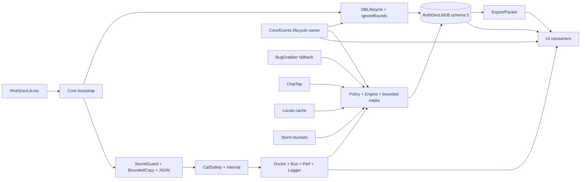

# Code graph

```mermaid
flowchart LR
  TOC["!RothDevLib.toc"] --> Core["Core bootstrap"]
  Core --> DBL["DBLifecycle + IgnoreBounds"]
  Core --> Guard["SecretGuard + BoundedCopy + JSON"]
  Guard --> Calls["CallSafety + Internal"]
  Calls --> Services["Doctor + Bus + Perf + Logger"]
  Services --> Capture["Policy + Engine + bounded intake"]
  Capture --> DB[("RothDevLibDB schema 5")]
  DBL --> DB
  DB --> Export["Export/Packer"]
  Services --> UI["UI consumers"]
  DB --> UI
  Export --> UI
  Events["Core/Events lifecycle owner"] --> DBL
  Events --> Capture
  Events --> UI

  Bug["BugGrabber fallback"] --> Capture
  Chat["ChatTap"] --> Capture
  Locals["Locals cache"] --> Capture
  Storm["Storm buckets"] --> Capture
```

All arrows into persistence, callbacks, logs or UI cross an ordinary-value and bounded-retention boundary. Runtime client validation remains separate from offline CI.
